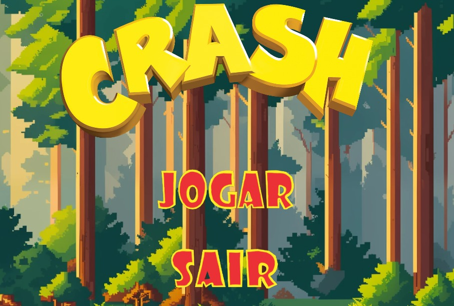

# MyFirstGame — CRASH

>Projeto Acadêmico Final do Primeiro Período

Criei esse jogo pela minha paixão de infância de jogar Crash Titans. A partir disso defini o tema sendo Crash, esse é um jogo de plataforma desenvolvido como projeto final do **primeiro período do curso de Ciência da Computação**. O projeto foi desenvolvido utilizando o **AppGameKit**, aplicando conhecimentos adquiridos nas disciplinas de **Construção de Algoritmos** e **Laboratório de Programação**.

## Objetivo

O jogador controla o Crash e deve percorrer **5 fases**, coletando as mangas ao final de cada nível para avançar. Durante o percurso, é necessário **Gambás**, utilizar plataformas e caixas e chegar ao final sem perder todas as tentativas.

Ao concluir a última fase, o jogo apresenta uma tela de vitória. Caso o Crash colida com um inimigo, é exibida a tela de **Game Over**.

## Ferramentas

* **AppGameKit** — desenvolvimento e execução do jogo.
* **Basic** — linguagem utilizada para programação da lógica do jogo.
* **Sprites e imagens** — criação dos personagens, cenários, menus e elementos das fases.
* **Áudio** — músicas e efeitos sonoros para ações, vitória e derrota.

## Conceitos utilizados

O projeto permitiu aplicar conceitos fundamentais de programação, como:

* Variáveis e tipos de dados;
* Estruturas condicionais (`if/else`);
* Estruturas de repetição (`for` e `do/loop`);
* Vetores;
* Funções e comandos da biblioteca do AppGameKit;
* Detecção de colisões;
* Controle de entrada pelo teclado e mouse;
* Movimentação e física dos objetos;
* Gravidade, velocidade e salto;
* Animação de sprites;
* Controle de estados do personagem;
* Organização do jogo em diferentes fases;
* Reprodução de músicas e efeitos sonoros.

O desenvolvimento do jogo serviu como uma introdução prática à programação de jogos, permitindo transformar os conceitos estudados nas disciplinas do primeiro período em um projeto interativo e funcional.

---
# Como Executar

Para executar o **CRASH**, siga os passos abaixo:

1. **Baixe o repositório** no GitHub em formato `.zip`.
2. **Extraia o arquivo `.zip`** para uma pasta do computador.
3. **Abra a pasta extraída** do projeto.
4. Localize o arquivo **`CRASH.exe`**.
5. **Execute o arquivo `CRASH.exe`** para iniciar o jogo.

> **Importante:** mantenha o arquivo `CRASH.exe` junto dos arquivos e pastas de recursos do projeto, como a pasta `media`, `CRASH.agk` e `main.agc` . Não mova ou exclua esses arquivos após a extração.

